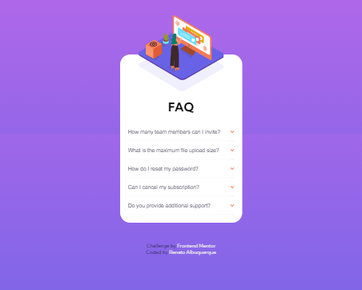
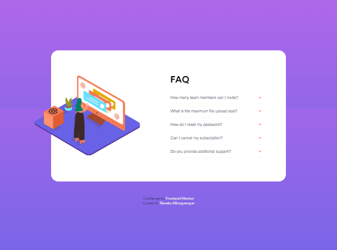

# FAQ Accordion Card

This is a solution to the [FAQ accordion card challenge on Frontend Mentor](https://www.frontendmentor.io/challenges/faq-accordion-card-XlyjD0Oam). Frontend Mentor challenges help you improve your coding skills by building realistic projects. 

## Table of contents

- [Overview](#overview)
  - [The challenge](#the-challenge)
  - [Screenshot](#screenshot)
  - [Links](#links)
- [My process](#my-process)
  - [Built with](#built-with)
- [Author](#author)

## Overview

### The challenge

Users should be able to:

- View the optimal layout for the component depending on their device's screen size
- See hover states for all interactive elements on the page
- Hide/Show the answer to a question when the question is clicked

### Screenshot

### Links

- [Solution URL here](https://github.com/renato-albuquerque/faq-accordion-card)
- [Live Site URL here](https://renato-albuquerque.github.io/faq-accordion-card/)

## My process

### Built with

- Semantic HTML5 markup
- CSS custom properties
- Flexbox
- JavaScript
- Mobile-first workflow

## Author

- Digital Business Card - [Renato Albuquerque](https://portfolio-renatoalbuquerque.vercel.app/)
- Website - [Personal Portfolio](https://portfolio-renatoalbuquerque.vercel.app/)
- Frontend Mentor - [@renato-albuquerque](https://www.frontendmentor.io/profile/renato-albuquerque)
- Linkedin - [renato-malbuquerque](https://www.linkedin.com/in/renato-malbuquerque/)
- Discord - [Renato Albuquerque#0025](https://discordapp.com/users/992621595547938837)
